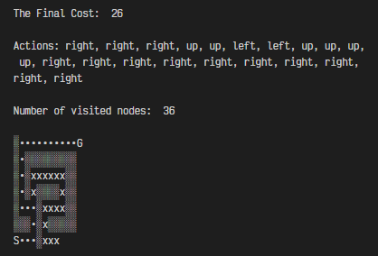

# AI-Maze
#### Maze solver using AI search Algorithms including:

- Breadth-First Search
- Depth-First Search
- Uniform-Cost Search
- greedy Best-First Search
- A* Search

**Usage:**
`python main.py maze1.txt greedy`

**Output Example**:

`•` refers to solution path

`x` refers to visited nodes
